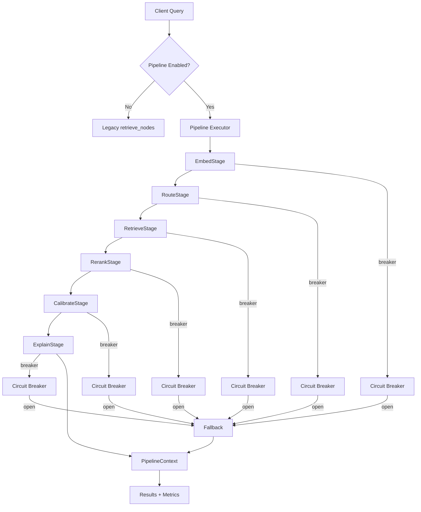
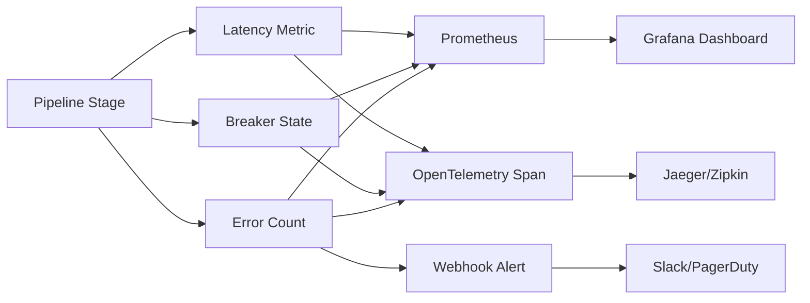
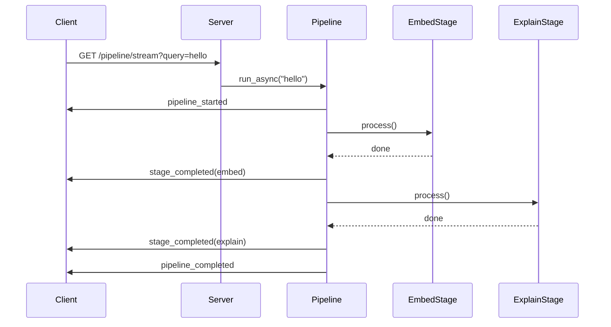
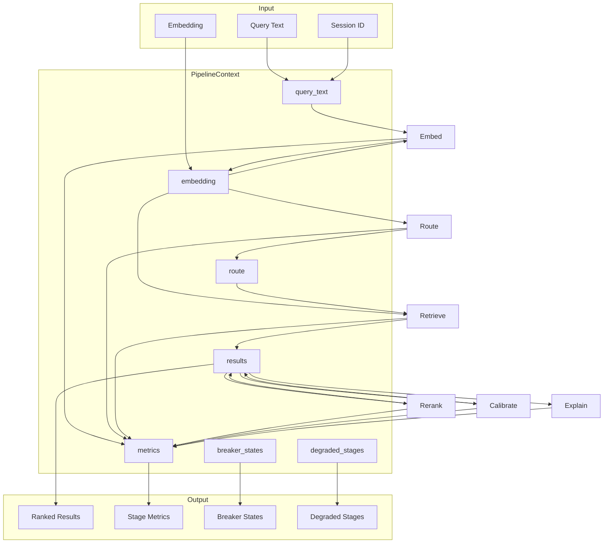
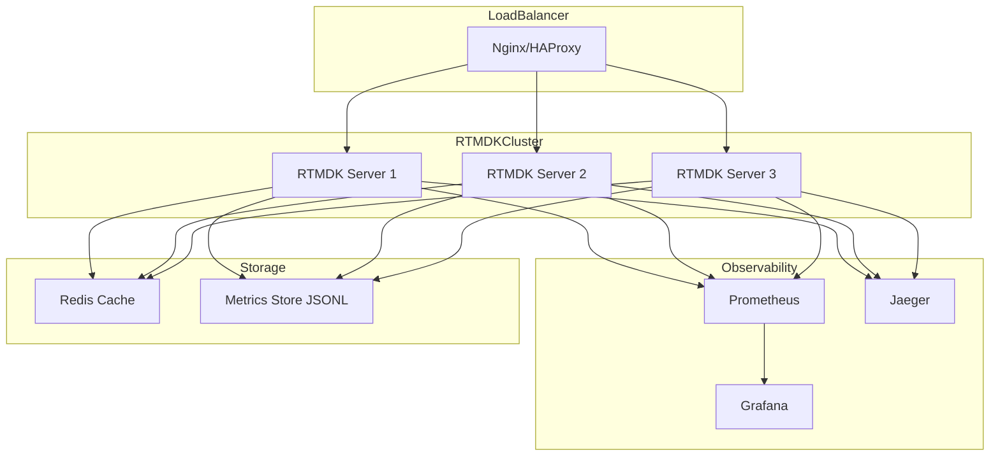

# Pipeline Architecture Diagram

## High-Level Flow

```mermaid
graph TD
    A[Client Query] --> B{Pipeline Enabled?}
    B -->|No| C[Legacy retrieve_nodes]
    B -->|Yes| D[Pipeline Executor]

    D --> E[EmbedStage]
    E --> F[RouteStage]
    F --> G[RetrieveStage]
    G --> H[RerankStage]
    H --> I[CalibrateStage]
    I --> J[ExplainStage]

    E -->|breaker| E1[Circuit Breaker]
    F -->|breaker| F1[Circuit Breaker]
    G -->|breaker| G1[Circuit Breaker]
    H -->|breaker| H1[Circuit Breaker]
    I -->|breaker| I1[Circuit Breaker]
    J -->|breaker| J1[Circuit Breaker]

    J --> K[PipelineContext]
    K --> L[Results + Metrics]

    E1 -->|open| M[Fallback]
    F1 -->|open| M
    G1 -->|open| M
    H1 -->|open| M
    I1 -->|open| M
    J1 -->|open| M

    M --> K
```

## Observability Stack

```mermaid
graph LR
    A[Pipeline Stage] --> B[Latency Metric]
    A --> C[Breaker State]
    A --> D[Error Count]

    B --> E[Prometheus]
    C --> E
    D --> E

    B --> F[OpenTelemetry Span]
    C --> F
    D --> F

    E --> G[Grafana Dashboard]
    F --> H[Jaeger/Zipkin]

    D --> I[Webhook Alert]
    I --> J[Slack/PagerDuty]
```

## Streaming Protocols

```mermaid
sequenceDiagram
    participant Client
    participant Server
    participant Pipeline
    participant Stage1 as EmbedStage
    participant StageN as ExplainStage

    Client->>Server: GET /pipeline/stream?query=hello
    Server->>Pipeline: run_async("hello")
    Pipeline->>Client: pipeline_started
    Pipeline->>Stage1: process()
    Stage1-->>Pipeline: done
    Pipeline->>Client: stage_completed(embed)
    Pipeline->>StageN: process()
    StageN-->>Pipeline: done
    Pipeline->>Client: stage_completed(explain)
    Pipeline->>Client: pipeline_completed
```

## Data Flow

```mermaid
graph TD
    subgraph Input
        Q[Query Text]
        E[Embedding]
        SID[Session ID]
    end

    subgraph PipelineContext
        C1[query_text]
        C2[embedding]
        C3[route]
        C4[results]
        C5[metrics]
        C6[breaker_states]
        C7[degraded_stages]
    end

    subgraph Output
        R[Ranked Results]
        M[Stage Metrics]
        BS[Breaker States]
        DS[Degraded Stages]
    end

    Q --> C1
    E --> C2
    SID --> C1

    C1 --> Embed
    C2 --> Embed
    Embed --> C2
    Embed --> C5

    C2 --> Route
    Route --> C3
    Route --> C5

    C2 --> Retrieve
    C3 --> Retrieve
    Retrieve --> C4
    Retrieve --> C5

    C4 --> Rerank
    Rerank --> C4
    Rerank --> C5

    C4 --> Calibrate
    Calibrate --> C4
    Calibrate --> C5

    C4 --> Explain
    Explain --> C5

    C5 --> M
    C6 --> BS
    C7 --> DS
    C4 --> R
```

## Production Deployment

```mermaid
graph TB
    subgraph LoadBalancer
        LB[Nginx/HAProxy]
    end

    subgraph RTMDKCluster
        S1[RTMDK Server 1]
        S2[RTMDK Server 2]
        S3[RTMDK Server 3]
    end

    subgraph Observability
        P[Prometheus]
        G[Grafana]
        J[Jaeger]
    end

    subgraph Storage
        R[Redis Cache]
        M[Metrics Store JSONL]
    end

    LB --> S1
    LB --> S2
    LB --> S3

    S1 --> P
    S2 --> P
    S3 --> P
    S1 --> J
    S2 --> J
    S3 --> J

    S1 --> R
    S2 --> R
    S3 --> R

    S1 --> M
    S2 --> M
    S3 --> M

    P --> G
```
